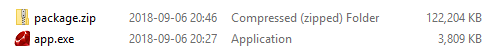
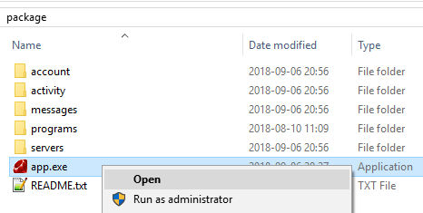

# Guide: How to use the executable

### 1. Request your data.
You can retrieve your past Discord messages by following the instructions in the [article](https://support.discordapp.com/hc/en-us/articles/360004027692) below.  
https://support.discordapp.com/hc/en-us/articles/360004027692

### 2. Download the data.  
  
Note: The email usually takes about a week, but can be up to 30 days.

### 3. Download executable.
Go to the [releases page](https://github.com/Brainicism/DiscordDataParser/releases) on github and download the `*.exe` file.  

You should now have the `package.zip` and the `*.exe`  

### 4. Extract the `package.zip` file.  

### 5. Move the `*.exe` into the `package` folder.  
  
Note: The name of the folder doesn't actually matter.

### 6. Run the `*.exe`.  

Once the program is done, it should open the visualization in a web browser by itself.  
If nothing happens, navigate to the `package/output/visualizations/` folder and open `index.html` in your web browser of choice.  

